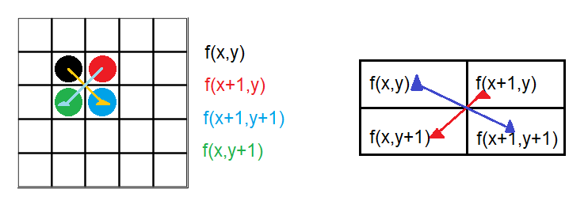
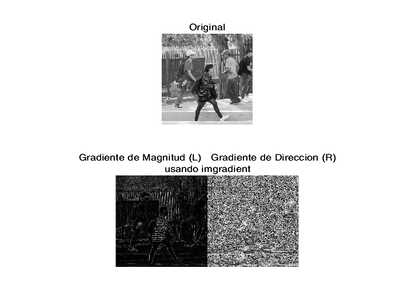

# Introducción 📖
Se propone realizar un programa que realise diferentes pruebas con la función <a href="https://www.mathworks.com/help/images/ref/imgradient.html">imgradient</a> e investigar cual es la diferencia con la función <a href="https://www.mathworks.com/help/images/ref/imgradientxy.html">imgradientxy</a> y hacer pruebas, pero antes de comenzar:

## ¿Qué es el procesamiento digital de imagenes (PDI)? 🤷‍♂️🤷‍
PDI se puede definir como el conjunto de procesamientos que se realizan sobre una imagen digital ya sea para realizar su almacenamiento, transmisión o tratamiento.

## Lectura de imágenes en matlab 👓
Para leer una imágen en matlab se utiliza la función <a href="https://la.mathworks.com/help/matlab/ref/imread.html"> **imread**</a> y se asigna a una variable que representara a la imágen.

<h5 align="center"><code>imagen = imread('ruta/nombre de la imágen.extensión');</code></h5>

## CONTRASTADO DE LA IMAGEN
Las técnicas de contrastación son útilies principalmente para resaltar los bordes en una imagen.

Existen métodos de contrastación en el dominio espacial y en el dominio de la frecuencia.

### El gradiente
El método más usado en la diferenciación de imágenes es el gradiente.

Se define el gradiente de una imagen $f(x,y)$ en el punto $(x,y)$ como el vector de dos dimensiones

$$G(f(x,y))= \begin{pmatrix}
G_x\\
\\
G_y
\end{pmatrix} = 
\begin{pmatrix}
\frac{\partial f}{\partial x}\\
\\
\frac{\partial f}{\partial y}
\end{pmatrix}$$

Una importante propiedad es que el vector gradiente $G$ apunta en la dirección de máximo cambio de $f$ en el punto $(x,y)$.

Para la detección de bordes sólo nos interesa la magnitud, que llamaremos simplemente gradiente y que denotaremos por:

$$G(f(x;y))$$

En una imagen digital las derivadas son aproximadas por diferencias; una de las aproximaciones que se suele hacer es:

$$G(f(x,y))=|f(x,y)-f(x+1,y-1)| + |f(x+1,y)-f(x,y+1)|$$

## FILTROS NO LINEALES
En estos filtros el valor de un pixel no está determinado como una combinación lineal de los valores de los pixeles vecinos.

En estos filtros también se realiza una operación de convolución entre la imagen a ser filtrada y una mascara.

Estas máscaras son llamadas operadores, donde matemáticamente, el operador utiliza dos kernels de 3x3 elementos para aplicar una convolución a la imagen y así calcular las aproximaciones de las derivadas. Un kernel para los cambios horizontales y otro para los verticales.

$G_x=\begin{bmatrix}
-1 & 0 & +1\\
-2 & 0 & +2\\
-1 & 0 & +1
\end{bmatrix} * A$
y
$G_y=\begin{bmatrix}
-1 & -2 & -1\\
0 & 0 & 0\\
+1 & +2 & +1
\end{bmatrix}*A$

Donde $A$ es la imagen original.

En cada punto de la imagen, los resultados de las aproximaciones de los gradientes se combinan para obtener la magnitud del gradiente

$$G=\sqrt{G_x^{2}+G_y^{2}}$$

## IMGRADIENT

<a href="https://www.mathworks.com/help/images/ref/imgradient.html">Imgradient</a> devuelve la magnitud del degradado, y la dirección del degradado.

La imagen debe estar en escala de grises; a continuación se muestra un código de ejemplo

~~~
im = imread('imagen.jpg')

im=rgb2gray(im)
imshow(im)
title('original')

[Gmag, Gdir]=imgradient(im)
figure
imshow(Gmag)
title('Gradiente Magnitud')

figure
imshow(Gdir)
title('Gradiente Dirección')
~~~

### Resultados ⚗🧪

Se propuso usar 5 imagenes diferentes y probar las dos funciones de matlab, a continuación se muestran los resultados obtenidos

<a href="https://github.com/ArturoEmmanuelToledoAguado/Imgradient/blob/main/Gradiente.m">Código</a>